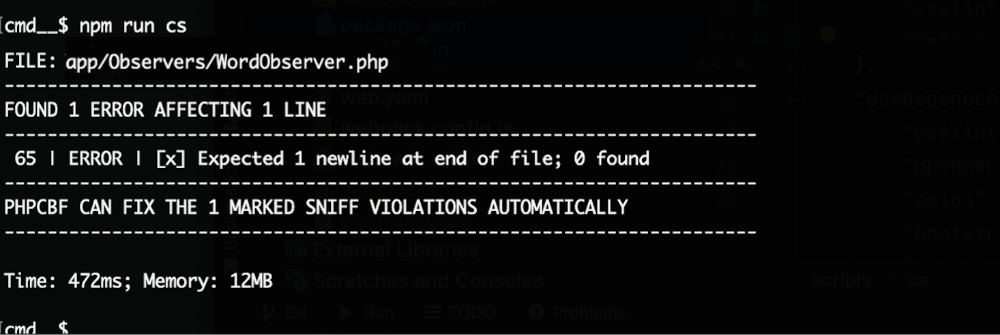
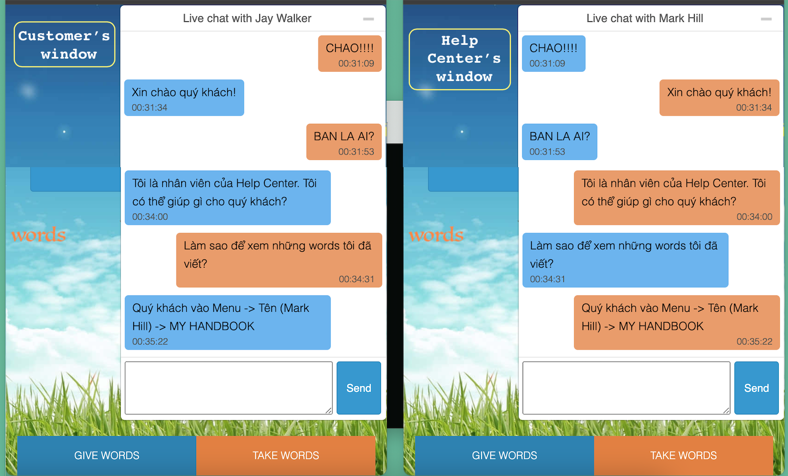

# * Complete website in Laravel *

## 1. 🛠️ Installation Guide
* cp .env.example .env
* composer install
* npm install
* php artisan key:generate
* php artisan migrate
* php artisan db:seed
* php artisan storage:link

## 2. RabbitMQ Configuration

RabbitMQ is used for live chat.

### Add connection to `config/queue.php`:

> This is the minimal config for the rabbitMQ connection/driver to work.

```php
'connections' => [
    // ...

    'rabbitmq' => [
    
       'driver' => 'rabbitmq',
       'hosts' => [
           [
               'host' => env('RABBITMQ_HOST', '127.0.0.1'),
               'port' => env('RABBITMQ_PORT', 5672),
               'user' => env('RABBITMQ_USER', 'guest'),
               'password' => env('RABBITMQ_PASSWORD', 'guest'),
               'vhost' => env('RABBITMQ_VHOST', '/'),
           ],
           // ...
       ],
       // ...
    ],

    // ...    
],
```


## 3. Elastic Configuration

Follow the [Official Elasticsearch](https://github.com/elastic/elasticsearch-php) page for detail.

```
php artisan vendor:publish --provider="Elastic\Client\ServiceProvider"
```
```
php artisan vendor:publish --provider="Elastic\Migrations\ServiceProvider"
```
#### If successful:
[]


## 4. Run
```
php artisan serve
```

## 5. 📷 Screenshots

### Code Standard:
Use PHP Codesniffer and ESLint to validate: 
``` npm run cs ```
``` npm run lint ```

[]()

### Live chat

[]()


